# Software Design Description (SDD)
## 1. Introduction

### 1.1 Purpose
The purpose of this Software Design Description (SDD) is to provide a detailed design for the YouTube clone video streaming platform. This document describes the software's architecture, components, interfaces, and their interactions to ensure that the implementation meets the system's functional and non-functional requirements.

### 1.2 Scope
The YouTube clone system enables users to upload, view, and interact with video content via a web or mobile application. The platform supports video streaming, user interaction (likes, comments), and content management. The system includes the frontend application, backend API services, real-time communication, and integration with external services like content delivery networks (CDNs) and analytics tools.

### 1.3 Design Goals
The design aims to achieve the following objectives:
- Create a scalable and high-performance video streaming platform
- Provide an intuitive and responsive user experience
- Implement robust security and privacy measures
- Enable seamless content discovery and interaction
- Support cross-platform functionality

### 1.4 Architectural Principles
The system design follows these key architectural principles:
- Microservices architecture for modularity and scalability
- Event-driven design for real-time interactions
- Loosely coupled components to ensure system flexibility
- Containerization for consistent deployment
- Cloud-native implementation

## 2. System Architecture
### 2.1 Architecture Overview
The YouTube clone will utilize a distributed, microservices-based architecture with the following key layers:

- **Presentation Layer**:
  - React for web application
  - React Native for mobile applications
  - Server-side rendering for improved performance
  - Progressive Web App (PWA) support

- **Application Layer**:
  - Microservices using Node.js and Express
  - GraphQL API for flexible data querying
  - gRPC for efficient inter-service communication

- **Data Layer**:
  - Primary database: MongoDb
  - Caching layer: Redis
  - Search functionality: Elasticsearch
  - File storage: Distributed cloud storage

## 3. System Capabilities
### 3.1 Advanced Features
The platform will include advanced capabilities:

#### 3.1.1 Machine Learning Integration
- Personalized content recommendation
- Automated content moderation
- Viewer behavior prediction
- Trend analysis and insights

#### 3.1.2 Real-time Capabilities
- WebSocket-based live streaming
- Real-time commenting system
- Instant notifications
- Interactive live events support

# 4. Module Design

## 4.1 Frontend Architecture

```plantuml
@startuml
!theme plain
title YouTube Clone - Frontend Architecture

package "Frontend Application" {
    ' Core Architecture Layers
    package "Presentation Layer" {
        [Pages/Views] as Pages
        [Components] as Components
        [Layouts] as Layouts
    }

    package "State Management" {
        [Redux Store] as ReduxStore
        [Action Creators] as Actions
        [Reducers] as Reducers
        
        folder "Slices" {
            [User Slice] as UserSlice
            [Video Slice] as VideoSlice
            [Channel Slice] as ChannelSlice
            [Playlist Slice] as PlaylistSlice
        }
    }

    package "Services Layer" {
        [Authentication Service] as AuthService
        [Video Service] as VideoService
        [Channel Service] as ChannelService
        [Interaction Service] as InteractionService
    }

    package "Routing" {
        [React Router] as Router
        [Route Configuration] as RouteConfig
    }

    package "Utilities" {
        [API Interceptor] as APIInterceptor
        [Error Handling] as ErrorHandler
        [Authentication Middleware] as AuthMiddleware
    }

    package "UI Kit & Styling" {
        [Tailwind CSS] as Styling
        [Shadcn UI Components] as UIKit
        [Custom Icons] as Icons
    }

    package "Performance Optimization" {
        [Code Splitting] as CodeSplit
        [Lazy Loading] as LazyLoad
        [Memoization] as Memoization
    }
}

package "External Integrations" {
    [Google OAuth] as OAuth
    [Video Player] as VideoPlayer
    [Analytics] as Analytics
}

' Relationship Connections
Pages -down-> Router
Pages -down-> Components
Pages -down-> ReduxStore

Components -down-> UIKit
Components -down-> Icons
Components -down-> Styling

ReduxStore -down-> Actions
ReduxStore -down-> Reducers

Actions -down-> Services
Reducers -down-> Services

Services -down-> APIInterceptor
Services -down-> AuthMiddleware

Router -down-> RouteConfig
Router -down-> LazyLoad

APIInterceptor -down-> OAuth
APIInterceptor -down-> ErrorHandler

' Performance Optimization Connections
Pages -down-> CodeSplit
Components -down-> Memoization

' External Integration Connections
Pages -down-> VideoPlayer
Pages -down-> Analytics

note right of "Frontend Application"
    Technology Stack:
    - React 18
    - Redux Toolkit
    - React Router
    - TypeScript
    - Tailwind CSS
    - Shadcn UI
    Responsive and Performant Design
end note
}
@enduml
```




### 4.1.1 Architectural Overview
- **Modular Component-Based Design**: Utilizing React/Next.js for scalable frontend architecture
- **Responsive Design**: Adaptive layout for web and mobile platforms
- **State Management**: Implementing Redux/Context API for global state management
- **Performance Optimization**: Code splitting, lazy loading, and efficient rendering

### 4.1.2 User Interface Modules
#### 1. Authentication Module
- Login/Registration interfaces
- Social media authentication
- Password recovery workflows
- Multi-factor authentication support

#### 2. Content Discovery Module
- Personalized recommendation grid
- Trending and categorized content sections
- Advanced search and filtering mechanisms
- Content carousel and horizontal scrolling views

#### 3. Video Interaction Module
- Adaptive video player
- Interactive engagement tools (likes, comments, shares)
- Fullscreen and Picture-in-Picture modes
- Quality and playback speed controls

#### 4. User Profile Module
- Comprehensive profile management
- Content upload capabilities
- Watch history and saved playlists
- Channel customization options

### 4.1.3 Client-Side Processing
- **Local Caching**: Implementing browser storage for performance
- **Offline Support**: Service worker integration
- **Real-time Updates**: WebSocket connections for live interactions
- **Error Boundary Management**: Graceful error handling and user notifications

## 4.2 Backend System Architecture


```plantuml
@startuml
!define DARKBLUE
!includeurl https://raw.githubusercontent.com/Argonaut-B04/PlantUML-style-C4/master/style.puml

title YouTube Clone - Backend System Architecture

frame "Frontend Layer" {
    [Web Client] as WebClient
    [Mobile Client] as MobileClient
}

cloud "API Gateway" {
    [Nginx / Kong API Gateway] as APIGateway
}

frame "Authentication Services" {
    [Authentication Service] as AuthService
    database "User Database" {
        [MongoDB - User Profiles] as UserDB
    }
}

frame "Video Processing Microservices" {
    [Video Upload Service] as UploadService
    [Video Encoding Service] as EncodingService
    [Thumbnail Generation Service] as ThumbnailService
    
    database "Video Metadata DB" {
        [PostgreSQL - Video Metadata] as VideoMetadataDB
    }
    
    storage "Video Storage" {
        [Distributed File Storage] as VideoStorage
    }
}

frame "Content Delivery" {
    [CDN Service] as CDN
}

frame "Content Services" {
    [Video Recommendation Service] as RecommendationService
    [Search Service] as SearchService
    [Analytics Service] as AnalyticsService
    
    database "Redis Caches" {
        [View Count Cache] as ViewCache
        [Recommendation Cache] as RecommendCache
    }
    
    database "Elasticsearch" {
        [Video Search Index] as SearchIndex
    }
}

frame "Social Interaction Services" {
    [Comment Service] as CommentService
    [Interaction Service] as InteractionService
    
    database "Interaction Database" {
        [Cassandra - Likes/Comments] as InteractionDB
    }
}

frame "Monetization Services" {
    [Monetization Service] as MonetizationService
    database "Billing Database" {
        [PostgreSQL - Earnings] as BillingDB
    }
}

frame "Message Queues & Event Streaming" {
    [Apache Kafka] as EventBus
    [RabbitMQ] as MessageQueue
}

frame "Monitoring & Observability" {
    [Prometheus] as Monitoring
    [Grafana] as Dashboard
    [ELK Stack] as Logging
}

' Connections
WebClient --> APIGateway
MobileClient --> APIGateway

APIGateway --> AuthService : Authentication
APIGateway --> UploadService : Video Upload
APIGateway --> CommentService : Comments
APIGateway --> InteractionService : Likes/Interactions

AuthService --> UserDB : Store/Retrieve Users
AuthService --> EventBus : User Events

UploadService --> VideoStorage : Store Videos
UploadService --> EncodingService : Trigger Encoding
UploadService --> VideoMetadataDB : Store Metadata
UploadService --> EventBus : Upload Events

EncodingService --> ThumbnailService : Generate Thumbnails
EncodingService --> VideoStorage : Store Processed Videos
EncodingService --> EventBus : Encoding Events

RecommendationService --> SearchIndex
RecommendationService --> RecommendCache
RecommendationService --> EventBus : Recommendation Events

CommentService --> InteractionDB : Store Comments
CommentService --> EventBus : Comment Events

InteractionService --> InteractionDB : Store Interactions
InteractionService --> ViewCache : Update View Counts

CDN --> VideoStorage : Distribute Content

SearchService --> SearchIndex : Update/Query
SearchService --> EventBus : Search Events

AnalyticsService --> EventBus : Consume Events
AnalyticsService --> Monitoring : Report Metrics

MonetizationService --> BillingDB : Track Earnings
MonetizationService --> EventBus : Monetization Events

EventBus <--> MessageQueue : Event Routing

Monitoring --> Logging : Collect Logs
Monitoring --> Dashboard : Visualize Metrics

@enduml
```

### 4.2.1 Distributed Service Ecosystem
- **Microservices Architecture**: Independently scalable services
- **Event-Driven Communication**: Kafka/RabbitMQ for inter-service messaging
- **Service Discovery**: Consul/Kubernetes for dynamic service registration

### 4.2.2 Authentication and Security Layer
#### 1. Identity Management
- JWT-based authentication
- Role-based access control
- OAuth 2.0 and OpenID Connect support
- Passwordless authentication options

#### 2. Security Mechanisms
- Encrypted token storage
- Brute-force protection
- Cross-Site Scripting (XSS) prevention
- SQL injection safeguards

### 4.2.3 Content Management Services
#### 1. Video Processing Service
- Multi-format video transcoding
- Adaptive bitrate streaming
- Thumbnail generation
- Metadata extraction
- Content moderation

#### 2. Storage Management
- Distributed file storage (AWS S3/Google Cloud Storage)
- Content Delivery Network (CDN) integration
- Efficient storage tiering
- Backup and disaster recovery

### 4.2.4 Recommendation and Discovery Engine
#### 1. Machine Learning Models
- Collaborative filtering
- Content-based recommendation
- Hybrid recommendation algorithms
- User behavior analysis

#### 2. Personalization Mechanisms
- Real-time preference tracking
- Contextual recommendation
- A/B testing recommendation strategies
- Diversity and serendipity in suggestions

### 4.2.5 Interaction and Engagement Services
#### 1. User Interaction Tracking
- Like, comment, and share mechanisms
- Notification dispatch system
- Engagement metrics collection
- Community interaction workflows

#### 2. Social Features
- Follow/subscribe functionality
- User-generated playlists
- Community content curation
- Collaborative viewing experiences

## 4.3 Cross-Cutting Concerns
### 4.3.1 Observability and Monitoring
- Distributed tracing
- Performance metrics collection
- Log aggregation
- Real-time alerting systems

### 4.3.2 Scalability Strategies
- Horizontal service scaling
- Load balancing
- Caching mechanisms
- Auto-scaling configuration

### 4.3.3 Compliance and Privacy
- GDPR compliance
- Data anonymization
- User consent management
- Transparent data handling

## 4.4 Advertising Ecosystem

### 4.4.1 Ad Targeting Strategy
- Demographic-based targeting
- Interest and behavior profiling
- Geographic location targeting
- Device-specific ad delivery

### 4.4.2 Ad Placement Types
1. Video Ad Formats
- Pre-roll ads
- Mid-roll ads
- Post-roll ads
- Overlay advertisements

2. Additional Placement Channels
- Sidebar recommendations
- Banner advertisements
- Sponsored content sections

### 4.4.3 Revenue Generation
- Impression-based pricing (CPM)
- Performance-based pricing (CPC)
- Revenue sharing with content creators
- Conversion tracking

### 4.4.4 Compliance and User Experience
- User ad preference settings
- Opt-out mechanisms
- Ad frequency capping
- Content moderation
- Brand safety filters

### 4.4.5 Technical Infrastructure
- Low-latency ad delivery
- Real-time bidding integration
- Fraud detection mechanisms
- Cross-platform ad compatibility

### 4.4.6 Advertiser Tools
- Self-service ad creation platform
- Campaign management dashboard
- Performance analytics
- A/B testing capabilities


## 5. Database Design
The YouTube clone uses a combination of SQL and NoSQL databases. Below is the schema for major entities:

- **Users**: Stores user information like username, email, and preferences.
- **Videos**: Stores video metadata, upload details, and URLs.
- **Comments**: Stores user comments and associated metadata.
- **Interactions**: Tracks likes, views, and subscriptions.

<image src="./database-design.png"/>

#### Plantuml code
```
@startuml
left to right direction
actor User
actor "Unregistered Visitor" as Visitor
actor "Content Creator" as Creator
actor "Administrator" as Admin

rectangle YouTube {
    // Authentication Use Cases
    usecase "Register Account" as Register
    usecase "Login" as Login
    usecase "Manage Profile" as ManageProfile

    // Video Interaction Use Cases
    usecase "Watch Video" as WatchVideo
    usecase "Upload Video" as UploadVideo
    usecase "Edit Video Details" as EditVideo
    usecase "Delete Video" as DeleteVideo
    usecase "Like/Dislike Video" as RateVideo
    usecase "Comment on Video" as Comment
    usecase "Share Video" as ShareVideo

    // Channel Interaction Use Cases
    usecase "Create Channel" as CreateChannel
    usecase "Customize Channel" as CustomizeChannel
    usecase "Subscribe to Channel" as Subscribe
    usecase "View Channel Analytics" as ChannelAnalytics

    // Playlist Use Cases
    usecase "Create Playlist" as CreatePlaylist
    usecase "Add Video to Playlist" as AddToPlaylist
    usecase "Remove Video from Playlist" as RemoveFromPlaylist

    // Search and Discovery
    usecase "Search Videos" as Search
    usecase "Recommended Videos" as Recommendations
    usecase "Browse Categories" as BrowseCategories

    // Monetization
    usecase "Enable Monetization" as Monetize
    usecase "View Earnings" as ViewEarnings

    // Admin Use Cases
    usecase "Content Moderation" as Moderation
    usecase "User Management" as UserManagement
    usecase "Platform Settings" as PlatformSettings

    // Relationships
    Visitor --> WatchVideo
    Visitor --> Search
    Visitor --> Login
    Visitor --> Register

    User --> Login
    User --> WatchVideo
    User --> RateVideo
    User --> Comment
    User --> ShareVideo
    User --> Search
    User --> CreatePlaylist
    User --> AddToPlaylist
    User --> RemoveFromPlaylist
    User --> Subscribe
    User --> Recommendations
    User --> ManageProfile

    Creator --> UploadVideo
    Creator --> EditVideo
    Creator --> DeleteVideo
    Creator --> CreateChannel
    Creator --> CustomizeChannel
    Creator --> ChannelAnalytics
    Creator --> Monetize
    Creator --> ViewEarnings

    Admin --> Moderation
    Admin --> UserManagement
    Admin --> PlatformSettings
}
@enduml
```

## 6. Interface Design

### 6.1 API Design
Below are some of the REST API endpoints for interaction:

- **POST /upload**: Upload a video.
- **GET /videos**: Fetch video recommendations.
- **POST /comments**: Add a comment to a video.

### 6.2 External System Interfaces
- **CDN**: Delivers video content to users efficiently.
- **Analytics Tools**: Tracks user interactions and performance metrics.
- **Search Engine**: Provides fast and accurate search results.

### 6.3 Notification Flow Diagram
This diagram represents the flow of notifications for events like new comments or video uploads.

## 7. Non-Functional Requirements
### 7.1 Performance
- Support for 100,000 simultaneous users with peak load handling
- Maximum video load time: 2 seconds for standard definition
- Maximum video start time: 1 second for adaptive streaming
- Content delivery network (CDN) response time under 50 milliseconds
- Efficient resource utilization with less than 70% CPU and memory load during peak traffic
- Support for 4K and 8K video streaming with adaptive bitrate technology

### 7.2 Scalability
- Horizontal scaling capabilities for all backend services
- Microservices architecture supporting independent scaling
- Automatic horizontal scaling based on real-time traffic metrics
- Support for multi-region deployment
- Containerization using Docker and Kubernetes for seamless scaling
- Load balancing across multiple server instances
- Elastic database scaling with read replicas and sharding mechanisms

### 7.3 Availability
- 99.9% system uptime guarantee
- Redundant component architecture
- Multi-region failover support
- Automatic service recovery mechanisms
- Zero-downtime deployments
- Real-time health monitoring and automatic service restoration
- Geographically distributed data centers for continuous operation
- Backup and disaster recovery strategies

### 7.4 Security
- End-to-end encryption for all sensitive data
- Multi-factor authentication
- Role-based access control (RBAC)
- Comprehensive input validation and sanitization
- Protection against common web vulnerabilities:
  - SQL injection
  - Cross-site scripting (XSS)
  - Cross-site request forgery (CSRF)
- Regular security audits and penetration testing
- Compliance with international data protection regulations
- Secure API design with token-based authentication
- Advanced threat detection and prevention mechanisms

### 7.5 Reliability
- Automatic error detection and logging
- Graceful error handling
- Circuit breaker pattern implementation
- Comprehensive monitoring and alerting system
- Detailed performance and error reporting
- Automatic rollback of problematic deployments

### 7.6 Compliance
- GDPR compliance for user data protection
- CCPA data privacy regulations
- COPPA guidelines for content involving minors
- Accessibility standards (WCAG 2.1)
- Transparent data usage policies
- User consent management
- Right to be forgotten implementation

## 8. Conclusion
This comprehensive Software Design Description provides a thorough blueprint for a robust, scalable, and user-centric video streaming platform. By leveraging modern architectural principles, microservices design, and advanced technologies, the YouTube clone system is engineered to:

- Handle massive concurrent user loads
- Provide seamless and responsive user experiences
- Ensure high availability and performance
- Maintain stringent security and privacy standards
- Support future technological innovations

The modular design allows for independent scaling of components, while strategic integration with external services enables efficient content delivery, analytics, and user engagement. The platform is not merely a clone but a sophisticated, adaptable video streaming solution capable of competing in the dynamic digital media landscape.

Key differentiators include:
- Flexible microservices architecture
- Advanced machine learning recommendations
- Robust security and compliance frameworks
- Scalable infrastructure design
- Real-time interaction capabilities

Continuous improvement, regular performance optimizations, and staying aligned with emerging technologies will be critical to the platform's long-term success and user satisfaction.
